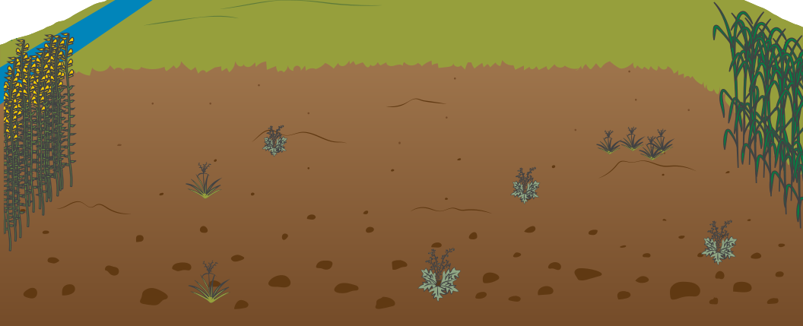

{{ site.url | append: site.baseurl }}/materials/diagram-images/
full-sized image

> - Pass out the large sheet of poster paper.
> - Instruct to fold in half and number like a book/card 1-4.

### Agroecosystem Diagram
_Graphics designed by:_ Heather Griffith, UF/IFAS Communications

**Agroecosystem** - the vision of agriculture as an ecological system;
environmental and ecological features interact in a dynamic and complex ways [<a href="{{ imageurl }}agroecosystem-highlights.png">{{ click }}</a>]

**Crop plant** - the focus of productivity for the agroecosystem; also might be
livestock [<a href="{{ imageurl }}single-tomato-plant.png">{{ click }}</a>]
{:height="20%" width="20%"}

**Crop population** - grouping of crop plants in monoculture [<a href="{{ imageurl }}tomatoes.png">{{ click }}</a>]
{:height="50%" width="50%"}

**Environment** - the non-living surroundings that impact crop plant growth;
such as water, temperature, light, and soil [<a href="{{ imageurl }}environment.png">{{ click }}</a>]
{:height="50%" width="50%"}

**Plant community** - the mixture of plants in and surrounding the crop field;
some are cooperators and some are competitors [<a href="{{ imageurl }}plants.png">{{ click }}</a>]
{:height="75%" width="75%"}
Plant communities add to biological diversity. These plants can help with
environmental conditions like soil quality and wind control. They may also pose
challenges for shade or disease. Plant cooperators can include cover crops
rotated with focal crops in time, intercrops spaced between focal crops, and
buffer strips that surround the field. In livestock systems, plant cooperators
are known as forage. Plant competitors are best known as weeds.

**Invertebrate community** - the group of microbes and insects in and
surrounding the crop field; some are beneficial and some are harmful [<a href="{{ imageurl }}invertebrates.png">{{ click }}</a>]
{:height="75%" width="75%"}
Invertebrate communities add to biological and ecological diversity.
Beneficial invertebrates can include pollinators, predators, parasitoids, and
microbes living on plants and in the soil. Harmful invertebrates can include
herbivores that eat plant leaves, bore plant stems, and suck plant fluids.
Other harmful invertebrates can deliver or be the cause of plant diseases.

**Vertebrate community** - the group of animals in and surrounding the crop
field; some are beneficial and some are harmful [<a href="{{ imageurl }}invertebrates.png">{{ click }}</a>]
{:height="75%" width="75%"}
Vertebrate communities add to biological and ecological diversity.
Beneficial vertebrates can leave manure for plant nutrition, eat weeds, and eat
plant pests. Harmful vertebrates eat the crop or promote weeds.

**Surrounding land** - the land around a farm provides resources and disturbance
through the connectivity and interaction with the farm; people play a critical
role in the management of the farm and consume the products harvested from the
farm; other farms, urban areas, and natural areas are a part of the surrounding
land [<a href="{{ imageurl }}surroundings.png">{{ click }}</a>]
{:height="75%" width="75%"}

**Agroecosystem interactions** - organisms that have a positive (in blue) and
negative (in red) effect on the crop [<a href="{{ imageurl }}agroecosystem-highlights.png">{{ click }}</a>]

> Do [Know your Agroecosystem]({{ site.baseurl }}/activities/The-agroecosystems-concept-know-your-agroecosystem-Intro), Step 1

### Agroecosystem Awareness

- A way to see the world that you can't unsee
- All the players in the system and their interactions over space and time
- Practice on our tour, for now...

> Do [Know your Agroecosystem]({{ site.baseurl }}/activities/The-agroecosystems-concept-know-your-agroecosystem-Intro), Step 2

### Agroecosystem Scale and Dynamics

- Organism -> Ecosystem -> Food System
- Space and Time

> Do [Know your Agroecosystem]({{ site.baseurl }}/activities/The-agroecosystems-concept-know-your-agroecosystem-Intro), Step 3
